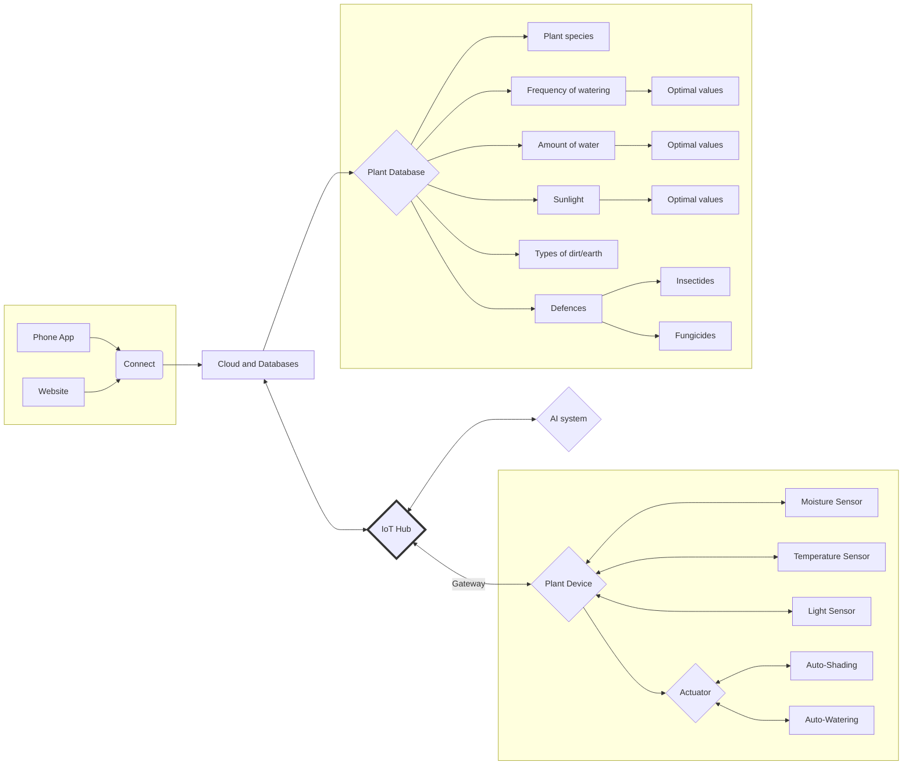

# The G2 Project

- DB: PostgreSQL DB
- Protocol communication: MQTT, HTTP
- Avg. calculations done on hub.
- Log handling, store in database, PostgreSQL

## High-Level Architechture Diagram

## Network Topology

