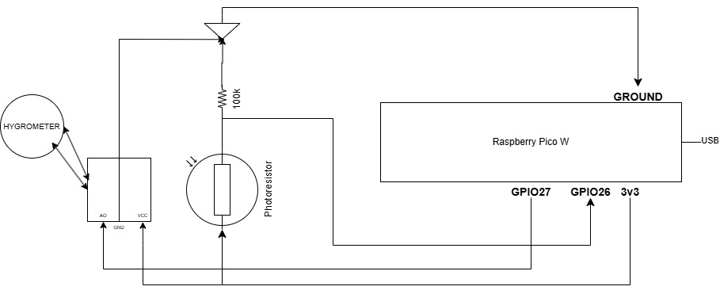

# Photoresistor Client for Pico W

## Overview
This project is a **C-based MQTT client** for the Raspberry Pi Pico W, which reads sensor data from a **photoresistor** and a **moisture sensor**. The data is sent via **MQTT** to an IoT hub running on a **Raspberry Pi 2**.

## Features
- **WiFi connectivity** using the **cyw43** driver.
- **MQTT communication** using the **lwIP MQTT library**.
- **FreeRTOS-based task scheduling** for sensor reading and MQTT publishing.
- **Configurable build system** via CMake for WiFi and MQTT credentials.

## Prerequisites

### Hardware
- Raspberry Pi Pico W
- Photoresistor (connected to ADC0, GPIO 26)
- Moisture sensor (connected to ADC1, GPIO 27)

### Software
- **Pico SDK** installed and configured.
- **FreeRTOS for Pico W**.
- **lwIP for networking**.
- **CMake for building**.

## Installation & Build

### 1. Clone the Repository
```bash
git clone <repo-url>
cd <repo-directory>
```

### 2. Build the Firmware
Use **CMake** to configure the build with your WiFi and MQTT credentials:
```bash
mkdir build && cd build
cmake -DWIFI_SSID="SSID" -DWIFI_PASS="PASSWORD" -DSERVER_IP="MQTT BROKER IP" -DSERVER_PORT="MQTT BROKER PORT" -DMQTT_USER="MQTT USER" -DMQTT_PASSWORD="MQTT USER PASSWORD" ..
make
```

### 3. Flash the Firmware
```bash
sudo picotool load firmware.uf2
```

## Configuration
### WiFi Configuration
WiFi credentials are set during the build process using CMake variables:
```bash
-DWIFI_SSID="your_ssid" -DWIFI_PASS="your_password"
```

### MQTT Configuration
MQTT broker details can be specified as:
```bash
-DSERVER_IP="your_mqtt_broker_ip" -DSERVER_PORT=1883 -DMQTT_USER="your_mqtt_user" -DMQTT_PASSWORD="your_mqtt_password"
```

## How it Works
1. **WiFi Connection**:
   - The device connects to the specified WiFi network.
   - If the connection fails, it retries every 5 seconds.

2. **Sensor Readings**:
   - Reads **photoresistor** (light level) and **moisture sensor** every **5 seconds**.

3. **MQTT Communication**:
   - Connects to the specified MQTT broker.
   - Publishes sensor data in JSON format:

   ```json
   {
     "device_id": "Pico01",
     "lightlevel": 3512,
     "moisture": 1350,
     "error_code": 0
   }
   ```

4. **Failure Handling**:
   - If the WiFi connection is lost, it attempts to reconnect.
   - If the MQTT broker is unreachable, it retries every **5 seconds**.

## Circuit diagram for Raspberry Pico W:



## Troubleshooting
### WiFi Does Not Connect
- Ensure the correct **SSID and password** are provided in the build command.
- Check the **signal strength**.
- Try resetting the device and reloading the firmware.

### MQTT Connection Issues
- Ensure the MQTT broker is **running and reachable**.
- Verify that the **port and authentication credentials** are correct.
- Check for **firewall restrictions** on your network.

## License
MIT License

## Acknowledgments
- Raspberry Pi Foundation for **Pico SDK**.
- lwIP project for **lightweight networking stack**.
- FreeRTOS project for **real-time task management**.

