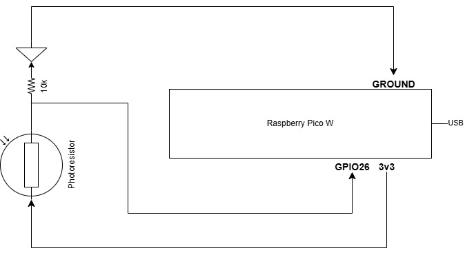

# Photoresistor Client - Anton

This project is a **photoresistor-based IoT client** designed for **Raspberry Pi Pico W**. It reads light intensity data using an **ADC (Analog-to-Digital Converter)** and transmits the values over **Wi-Fi** to a designated server via **TCP/IP**.

## Features

- Reads **light intensity** from a photoresistor using the ADC on the Raspberry Pi Pico W.
- Connects to **Wi-Fi** and communicates data via **TCP**.
- Periodically transmits sensor values to a **server**.
- Includes automatic **Wi-Fi reconnection** and **error handling**.
- Uses the **Raspberry Pi Pico SDK** and **LWIP TCP/IP stack**.

## Requirements

### Hardware
- **Raspberry Pi Pico W**
- **Photoresistor**
- **10kΩ pull-down resistor**
- **Wi-Fi network**

### Software
- **Raspberry Pi Pico SDK**
- **CMake (≥3.13)**
- **GNU Arm Embedded Toolchain**
- **OpenOCD (for debugging, optional)**

## Installation

### 1. Clone the Repository
To get the project files, clone the repository:

```sh
git clone https://github.com/bobolle/The-G2-Project.git
cd The-G2-Project/Photoresistor-Client-Anton
```

### 2. Set Up the Raspberry Pi Pico SDK
Before building the project, make sure the **Pico SDK** is installed and properly set up. If you haven't set it up yet, follow these steps:

#### Install the Pico SDK:
```sh
git clone -b master https://github.com/raspberrypi/pico-sdk.git ~/pico-sdk
cd ~/pico-sdk
git submodule update --init
```

#### Set the Environment Variable:
Every time you start a new terminal session, you need to set the environment variable:

```sh
export PICO_SDK_PATH=~/pico-sdk
```

To make this permanent, add the following line to your shell profile (`~/.bashrc` or `~/.zshrc`):

```sh
echo 'export PICO_SDK_PATH=~/pico-sdk' >> ~/.bashrc
source ~/.bashrc
```

### 3. Build the Project
Create a build directory, configure the project, and compile:

```sh
mkdir build
cd build
cmake -DWIFI_SSID="your_ssid" -DWIFI_PASS="your_password" -DSERVER_IP="your_server_ip" -DSERVER_PORT=your_server_port ..
make
```

Replace `"your_ssid"`, `"your_password"`, `"your_server_ip"`, and `"your_server_port"` with the actual values.

### 4. Flash the Firmware
Once compiled, flash the firmware onto the Raspberry Pi Pico W:

```sh
picotool load photoresistor.uf2
```

Alternatively, you can manually copy the `.uf2` file to the Pico's USB storage.

## Configuration

The firmware requires the following parameters at build time:
- `WIFI_SSID` – Your Wi-Fi SSID
- `WIFI_PASS` – Your Wi-Fi password
- `SERVER_IP` – The server's IP address
- `SERVER_PORT` – The server's listening port

These parameters must be provided when running `cmake`.

Example:

```sh
cmake -DWIFI_SSID="MyNetwork" -DWIFI_PASS="MyPassword" -DSERVER_IP="192.168.1.100" -DSERVER_PORT=8080 ..
```

## Circuit diagram for Raspberry Pico W:


## How It Works

1. Initializes **Wi-Fi** and attempts to connect.
2. Sets up the **ADC** to read photoresistor values.
3. Establishes a **TCP connection** to the specified server.
4. Periodically sends **light intensity data**.
5. Handles **network failures** and **server disconnections**.

## Troubleshooting

### Wi-Fi Connection Fails
- Ensure the **SSID** and **password** are correct.
- Check if the **Wi-Fi network** is within range.
- Try restarting the **Raspberry Pi Pico W**.

### No Data Received on Server
- Verify the **server IP and port**.
- Check if the **server is listening for TCP connections**.
- Confirm that the **Pico W is connected to Wi-Fi**.

## License
This project is licensed under the **MIT License**.

## Acknowledgments
Developed as part of *The G2 Project*.

