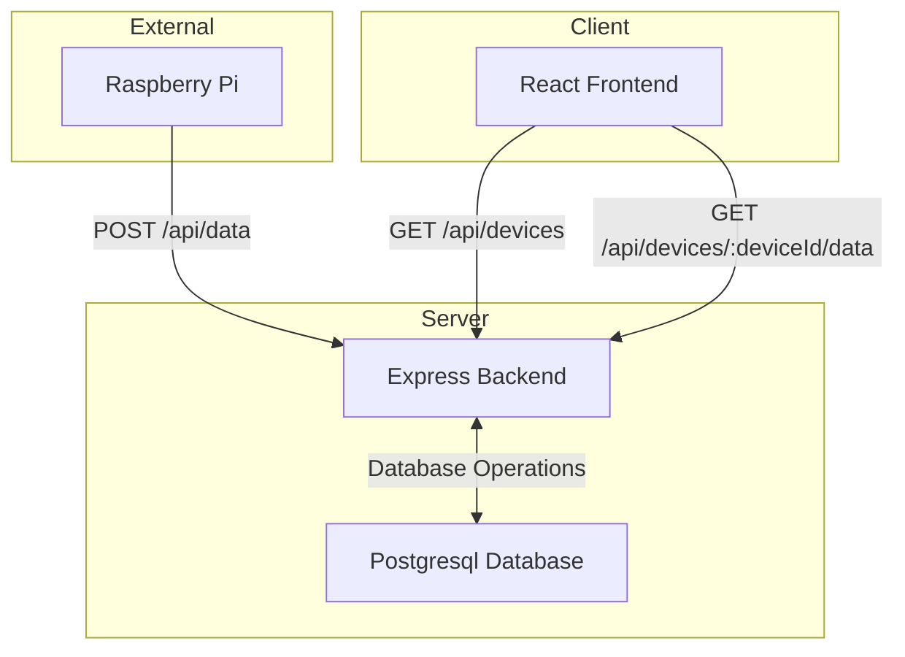
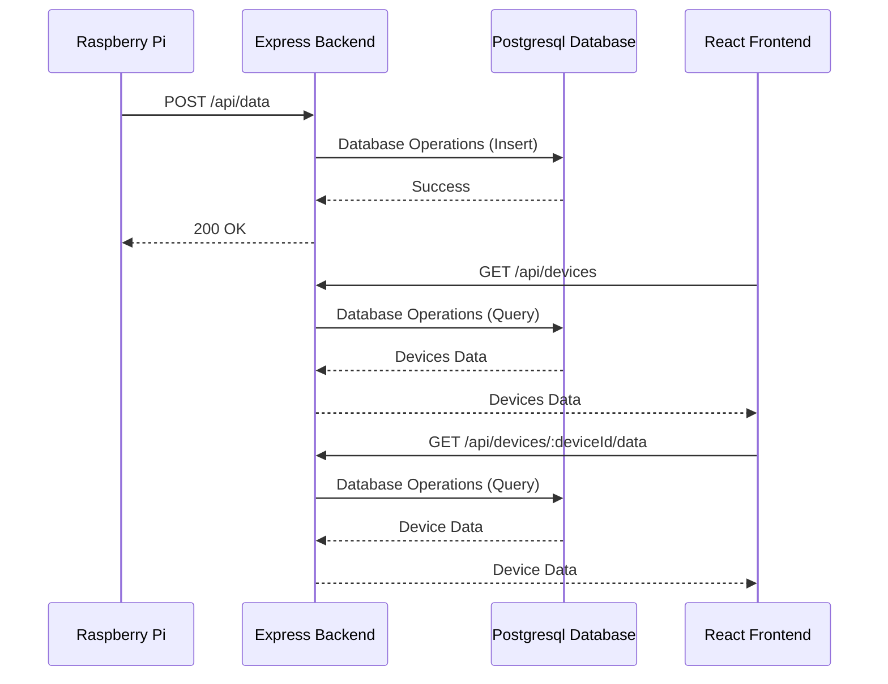

# Plant Test Project

This project consists of a React frontend and an Express backend. The frontend is built using Create React App, and the backend uses Postgresql and sqlalchemy for database operations.

Graph:

Sequence diagram:

