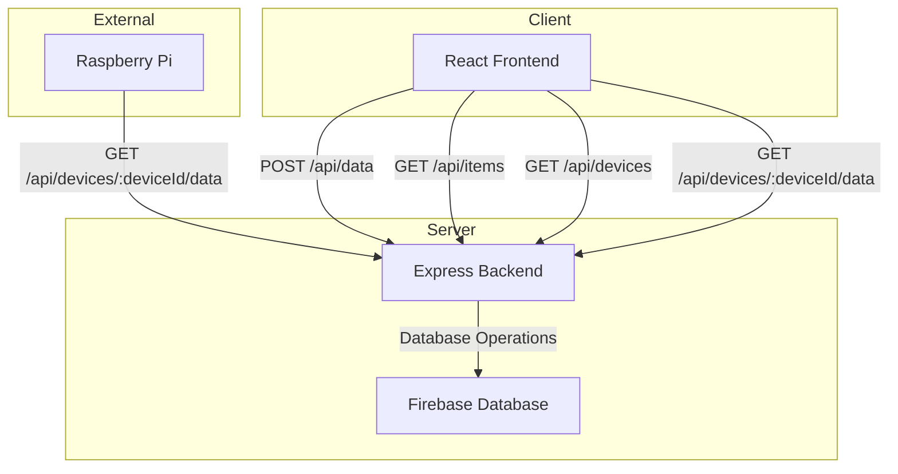

# Plant Test Project

This project consists of a React frontend and an Express backend. The frontend is built using Create React App, and the backend uses Firebase Admin SDK for database operations.

## Project Structure

### Client

The client folder contains the React frontend. Relevant files are App.js in /client/src and server.js in /server.

#### Available Scripts

In the `client` directory, you can run:

- `npm start`: Runs the app in development mode. Open [http://localhost:3000](http://localhost:3000) to view it in your browser.
- `npm test`: Launches the test runner in the interactive watch mode.
- `npm run build`: Builds the app for production to the `build` folder.
- `npm run eject`: Ejects the Create React App configuration.

#### Environment Variables

- `REACT_APP_API_URL`: The URL of the backend API (default is `http://localhost:5000/api`).

### Server

The server folder contains the Express backend.

#### Available Scripts

In the `server` directory, you can run:

- `node server.js`: Runs the server in development mode. The server will start on [http://localhost:5000](http://localhost:5000).

#### API Endpoints

- `POST /api/data`: Stores data for a specific device.
- `GET /api/items`: Fetches all items from the database.
- `GET /api/devices`: Fetches all devices from the database.
- `GET /api/devices/:deviceId/data`: Fetches the latest data for a specific device.

#### Python example

Python

import requests
import json

device_id = "plant1"  # Replace with your device ID
api_url = "http://localhost:5000/api/devices/" + device_id + "/data"  # Or your deployed URL

# Sample sensor data (replace with your actual sensor readings)
sensor_data = {
    "temperature": 25.5,
    "humidity": 60,
    "moisture": 40
}

try:
    response = requests.post(api_url, json=sensor_data)
    response.raise_for_status()  # Raise an exception for bad status codes (4xx or 5xx)
    print("Data sent successfully:", response.json())
except requests.exceptions.RequestException as e:
    print("Error sending data:", e)

#### Environment Variables

- `PORT`: The port on which the server will run (default is 5000).

## Learn More

To learn more about Create React App, check out the [Create React App documentation](https://facebook.github.io/create-react-app/docs/getting-started).

To learn more about Express, check out the [Express documentation](https://expressjs.com/).

To learn more about Firebase Admin SDK, check out the [Firebase Admin SDK documentation](https://firebase.google.com/docs/admin/setup).
